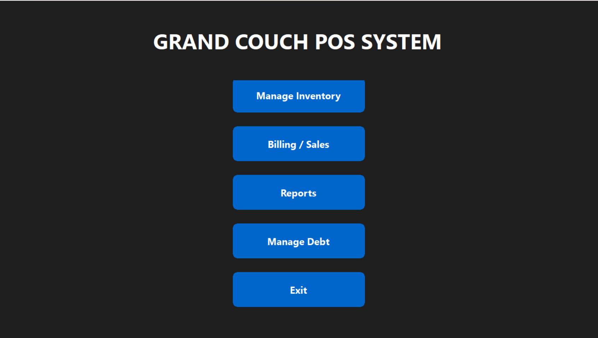
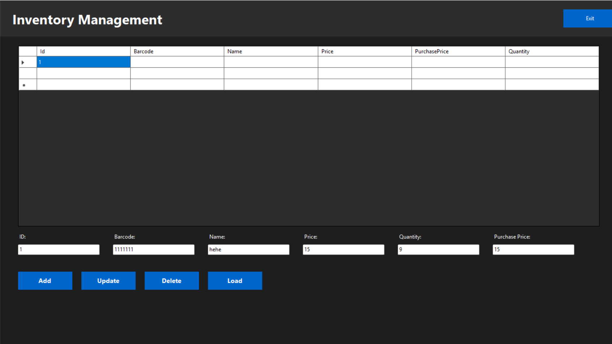
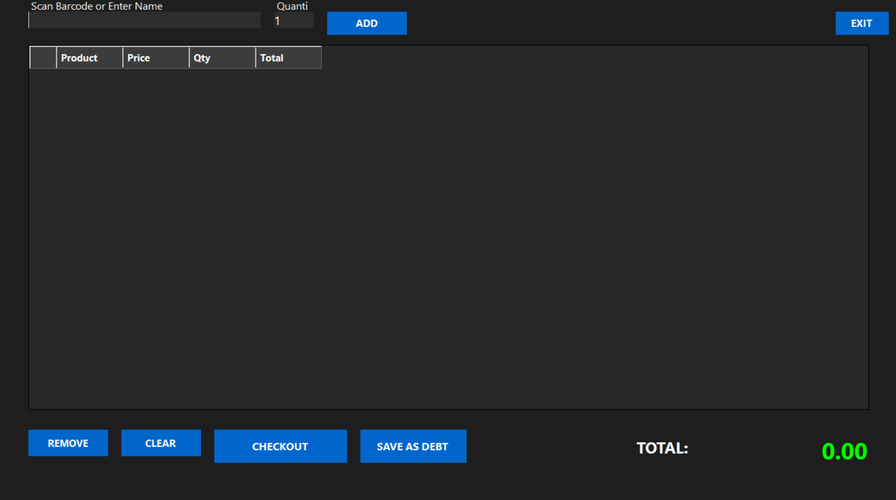
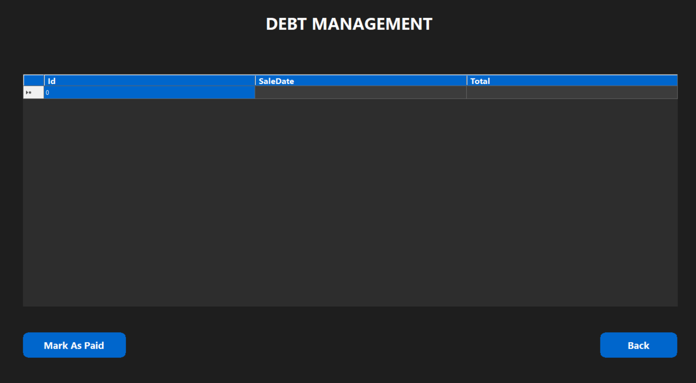

# Grand Couch POS System

A desktop **Point of Sale (POS)** application developed with **C#**, **Windows Forms**, and **SQLite**. The system is designed for small businesses to manage inventory, process sales, track customer debts, and generate business reports through a clean and intuitive interface.

---

## Features

### 📦 Inventory Management

* Add, edit, and delete products
* Search inventory instantly
* Monitor stock levels
* Prevent negative inventory

### 🛒 Billing & Sales

* Create customer invoices
* Automatic price and total calculation
* Process cash and debt purchases
* Validate stock availability before checkout

### 💳 Debt Management

* View outstanding customer debts
* Mark debts as paid
* Automatically update payment records
* Track unpaid balances

### 📊 Reports

* View sales reports
* Monitor inventory status
* Analyze business performance

### 🎨 User Interface

* Modern Windows Forms interface
* Dark theme
* Rounded buttons
* Simple and intuitive navigation

---

## Technologies Used

* C#
* .NET Windows Forms
* SQLite
* Microsoft.Data.Sqlite

---

## Screenshots

### Home Screen



### Inventory Management



### Billing



### Debt Management



### Reports


---

## Project Structure

```text
GrandCouchPOS
│
├── HomeForm
├── InventoryForm
├── BillingForm
├── DebtForm
├── ReportForm
│
├── inventory.db
└── Program.cs
```

---

## Database

The application uses a local **SQLite** database to store:

* Products
* Inventory quantities
* Sales history
* Customer debts
* Payment status

---

## Validation

The application includes several validation features:

* Prevents selling more products than are available in stock
* Prevents debt transactions when inventory is insufficient
* Automatically updates inventory after successful sales
* Validates user input before saving records

---

## Installation

1. Clone the repository:

```bash
git clone https://github.com/walidjohn02/grand-couch-pos.git
```

2. Open the solution in Visual Studio.

3. Restore NuGet packages.

4. Build and run the project.

---

## Future Improvements

* User authentication
* Customer management
* Barcode scanner support
* Receipt printing
* Export reports to PDF and Excel
* Dashboard analytics
* Product images
* Multi-user support
* Cloud database integration
* Automatic backup and restore

---

## What I Learned

Developing this project strengthened my understanding of:

* Object-Oriented Programming (OOP)
* Windows Forms application development
* SQLite database integration
* CRUD operations
* Event-driven programming
* Input validation
* Desktop application architecture

---

## License

This project is available for educational and portfolio purposes.

---

## Author

**Walid John**

If you have suggestions or improvements, feel free to fork the repository or open an issue.
